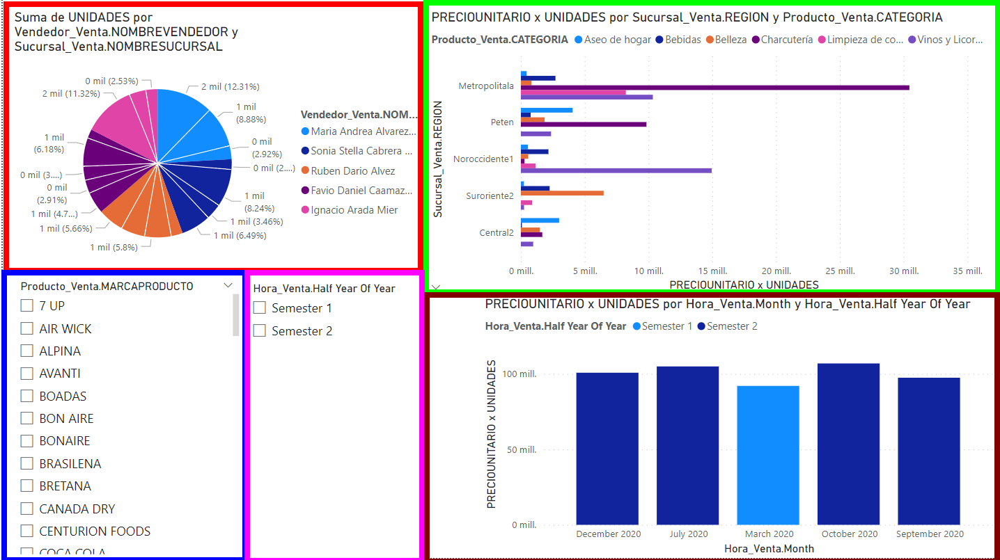

**Nombre:**
Douglas Alexander Soch Catalán

**Carnet:**
201807032

# Proyecto - SG Food

SG-Food es una empresa dedicada a la compra, distribución y comercialización de productos alimentarios y de uso personal. Durante la crisis del COVID-19, estas industrias no se detuvieron y, de hecho, vieron un aumento en sus ventas debido a que las personas acumulaban productos en casa. Debido a este crecimiento, SG-Food enfrenta desafíos con su sistema actual, que es lento y tiene problemas con la base de datos debido al volumen de solicitudes. Por ello, se necesita implementar una solución de Business Intelligence que mejore los tiempos de respuesta y reduzca la carga sobre la base de datos central.

## Datamarts implementados

Los datamarts obtenidos con respecto al analisis realizado son los siguientes:

### Ventas

### Compras

## Tablero PowerBI

### Ventas

El tablero obtenido tiene 5 diferentes secciones las cuales son las siguientes:

* **Reporte 1 (Rojo)**: Top de mes en donde más se ha gastado clasificado por año y por semestre. _Año->Semestre->Mes_
* **Reporte 2 (Verde)**: Top de Sucursales que más compraron   pudiendo observar la categoría de producto y producto adquirido. _Sucursal->Categoría Producto ->Producto_
* **Reporte 3 (Cafe)**: Top de mes en donde se hayan comprado el mayor número de unidades clasificadas por año y por semestre. _Año->Semestre->Mes_
* Filtro segun la marca del producto (Azul)
* Filtro segun el semestre (Fusia)

### Compras

El tablero obtenido tiene 5 diferentes secciones las cuales son las siguientes:

* **Reporte 1 (Cafe)**: Top vendedores que han vendido más unidades clasificados por sucursal. _Sucursal->Vendedor_
* **Reporte 2 (Rojo)**: Top regiones en donde se ha obtenido el mayor ingreso pudiendo observar Top de productos clasificados por Grupo de producto en cada región. _Región->Categoría Producto->Marca Producto->Producto_
* **Reporte 3 (Verde)**: Top de mes en donde más ingresos se han obtenido clasificado por año y por semestre. _Año->Semestre->Mes_
* Filtro segun el nombre de la sucursal (Amarillo)
* Filtro segun el mes (Azul)

